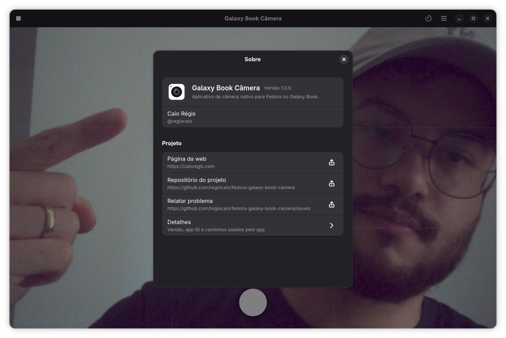
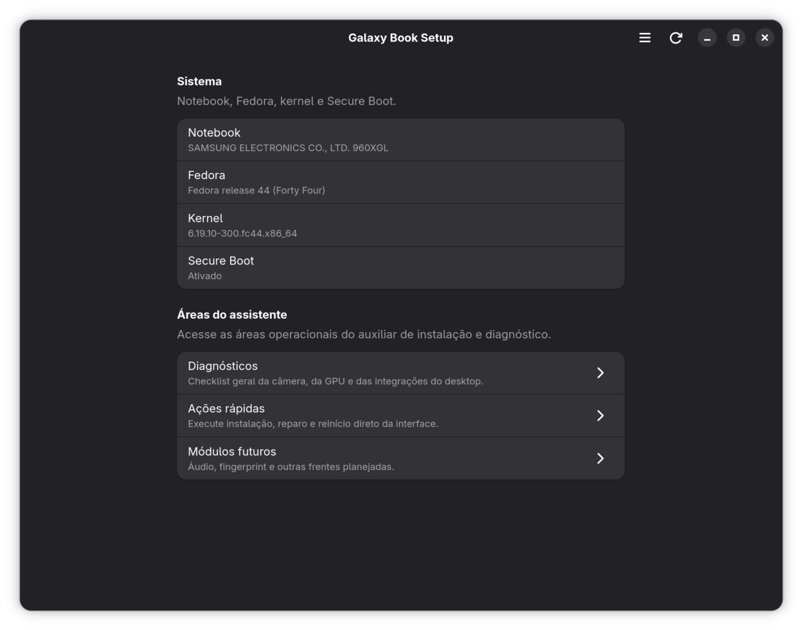
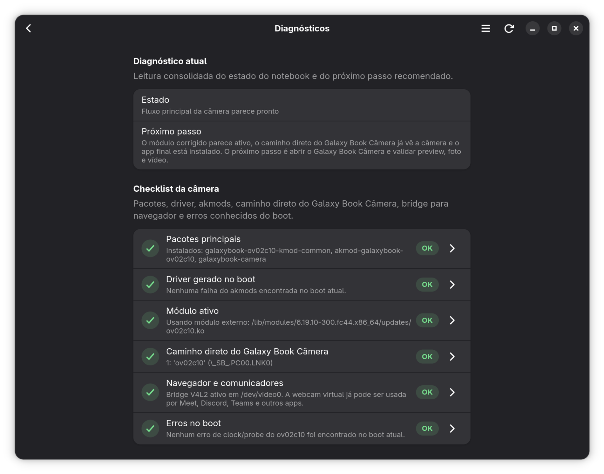
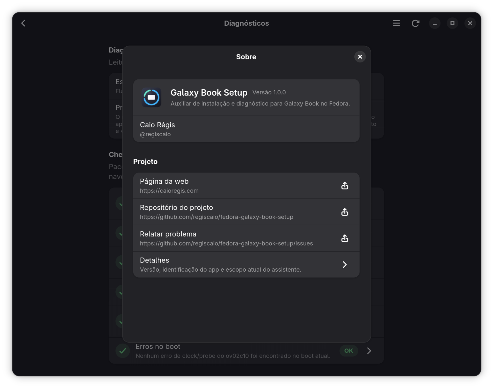

<p>
  <a href="README.md">🇧🇷 Português</a>
  <a href="README.en.md">🇺🇸 English</a>
  <a href="README.es.md">🇪🇸 Español</a>
  <a href="README.it.md">🇮🇹 Italiano</a>
</p>

# Fedora en el Samsung Galaxy Book4 Ultra

## Instalación rápida

Para instalar la línea actual de soporte principal del portátil mediante el repositorio DNF:

```bash
sudo dnf config-manager addrepo --from-repofile=https://packages.caioregis.com/fedora/caioregis.repo
sudo dnf install galaxybook-camera galaxybook-setup akmod-galaxybook-ov02c10 akmod-galaxybook-max98390
```

Este flujo instala:

- la app de cámara con UI nativa de GNOME;
- el asistente gráfico de instalación y diagnóstico;
- el controlador `ov02c10` empaquetado como `akmod`.
- el soporte `MAX98390` empaquetado como `akmod` para los altavoces internos.

> [!IMPORTANT]
> **Actualizado el 20 de abril de 2026**
>
> Esta guía reúne explicaciones técnicas, soluciones prácticas e información útil para usuarios de Fedora en el Samsung Galaxy Book4 Ultra, con foco en audio, cámara, lector de huellas y controladores NVIDIA.
>
> El contenido histórico de abajo fue **revalidado el 5 de abril de 2026** en un **Samsung Galaxy Book4 Ultra NP960XGL-XG1BR**, ejecutando **Fedora 43** con kernel **6.18.8-200.fc43.x86_64**.
>
> A partir del **19 de abril de 2026**, la solución de la cámara y el soporte dedicado a los altavoces internos pasaron a mantenerse en repositorios propios, con controlador, app de cámara con UI nativa de GNOME, asistente de instalación y controlador de audio separados. Este README sigue como guía general del portátil y apunta a esos proyectos cuando el tema es la webcam y el audio.
>
> La línea actual de los proyectos dedicados fue **verificada el 20 de abril de 2026** en un **Samsung Galaxy Book4 Ultra NP960XGL-XG1BR**, ejecutando **Fedora 44** con kernel **6.19.10-300.fc44.x86_64**, en las siguientes versiones:
>
> - `fedora-galaxy-book-ov02c10`: **1.0.0-1**
> - `fedora-galaxy-book-camera`: **1.0.0-2**
> - `fedora-galaxy-book-setup`: **1.0.0-4**
> - `fedora-galaxy-book-max98390`: **1.0.0-1**

| Especificación         | Detalles                                                                            |
| ---------------------- | :---------------------------------------------------------------------------------- |
| **Modelo**             | Samsung Galaxy Book4 Ultra (NP960XGL, NP960XGL-XG1BR, NP960XGLZ-EXP...)             |
| **Pantalla**           | 16" WQXGA+ (2880 x 1800) AMOLED Touchscreen                                         |
| **Procesador**         | Intel Core Ultra 9 185H (Meteor Lake, 16C/22T, hasta 5.1 GHz, 24 MB cache)          |
| **GPU**                | NVIDIA GeForce RTX 4070 Laptop 8 GB GDDR6                                           |
| **Memoria RAM**        | 32 GB LPDDR5X (soldada, no ampliable)                                               |
| **Almacenamiento**     | 1 TB SSD NVMe PCIe Gen4 (ampliable mediante ranura M.2 secundaria, según el modelo) |
| **Batería**            | 76 Wh (integrada, ion-litio)                                                        |
| **Cargador**           | 140 W USB-C (20V, 5A o 28V, 5A)                                                     |
| **Puertos**            | 2x Thunderbolt 4 (USB-C), 1x HDMI 2.1, 1x USB-A 3.2, 1x P2 (audio), 1x MicroSD      |
| **Red inalámbrica**    | Wi-Fi 6E (802.11ax), Bluetooth 5.3                                                  |
| **Webcam**             | 1080p FHD, sensor OmniVision OV02C10, IPU6 (MIPI)                                   |
| **Audio**              | 2x altavoces estéreo (AKG), micrófono doble, códec Realtek ALC298                   |
| **Teclado**            | Teclado retroiluminado, distribución ABNT2 (BR) o US, sensor de huellas integrado   |
| **Touchpad**           | Amplio, compatible con gestos Windows Precision                                     |
| **Lector de huellas**  | Integrado en el botón de encendido, compatible con Windows Hello                    |
| **Dimensiones**        | 355,4 x 250,4 x 16,5 mm                                                             |
| **Otros**              | Sensor de luz ambiente, soporte para Samsung Multi Control, Second Screen, Quick Share |
| **Certificaciones**    | ENERGY STAR, RoHS, FCC, CE                                                          |

* [Manual del Usuario](https://downloadcenter.samsung.com/content/UM/202506/20250618100447559/94xXGK_96xXGK_96xXGL_Win11_UM_ENG_Rev.2.0_250602.pdf)
* [Especificaciones](https://www.samsung.com/br/support/model/NP960XGL-XG1BR/)

> [!TIP]
> **Kernel recomendado:** Utiliza el kernel **6.15 o superior** para garantizar el reconocimiento adecuado del hardware del Galaxy Book4 Ultra. Las versiones anteriores presentan limitaciones importantes de compatibilidad.
>
> Si no eres un usuario avanzado, te recomiendo usar Windows 11, que ya viene instalado de fábrica y funciona perfectamente en este modelo.

---

## Índice

- [Fedora en el Samsung Galaxy Book4 Ultra](#fedora-en-el-samsung-galaxy-book4-ultra)
  - [Instalación rápida](#instalación-rápida)
  - [Índice](#índice)
  - [Repositorios dedicados](#repositorios-dedicados)
    - [Resumen de la solución actual de la cámara](#resumen-de-la-solución-actual-de-la-cámara)
    - [Por qué existe una app de cámara dedicada](#por-qué-existe-una-app-de-cámara-dedicada)
    - [Interfaces actuales](#interfaces-actuales)
      - [Galaxy Book Câmera](#galaxy-book-câmera)
      - [Galaxy Book Setup](#galaxy-book-setup)
  - [Estado actual](#estado-actual)
  - [Altavoces internos (Realtek ALC298)](#altavoces-internos-realtek-alc298)
    - [Flujo recomendado](#flujo-recomendado)
    - [Verificación](#verificación)
  - [Cámara interna (IPU6/OV02C10)](#cámara-interna-ipu6ov02c10)
    - [Solución actual](#solución-actual)
    - [Lo que ya no tiene sentido usar](#lo-que-ya-no-tiene-sentido-usar)
    - [Verificación](#verificación-1)
  - [Lector de huellas (Fingerprint)](#lector-de-huellas-fingerprint)
    - [Flujo recomendado](#flujo-recomendado-1)
    - [Verificación](#verificación-2)
  - [Chip de gráficos dedicados (NVIDIA RTX 4070)](#chip-de-gráficos-dedicados-nvidia-rtx-4070)
    - [Solución: instalación del controlador NVIDIA](#solución-instalación-del-controlador-nvidia)
    - [Verificación](#verificación-3)
  - [Diagnósticos rápidos](#diagnósticos-rápidos)
  - [Otros relatos](#otros-relatos)

---

## Repositorios dedicados

El trabajo de este portátil se dividió en repositorios dedicados para webcam, audio e instalación:

- [`fedora-galaxy-book-ov02c10`](https://github.com/regiscaio/fedora-galaxy-book-ov02c10)
  Controlador `ov02c10` ajustado y empaquetado como `akmod` para Fedora.
- [`fedora-galaxy-book-camera`](https://github.com/regiscaio/fedora-galaxy-book-camera)
  App de cámara con UI nativa de GNOME en `GTK4` y `libadwaita`, usando `libcamera`.
- [`fedora-galaxy-book-setup`](https://github.com/regiscaio/fedora-galaxy-book-setup)
  Asistente de instalación y diagnóstico con interfaz gráfica para cámara, webcam en navegadores/comunicadores, NVIDIA, perfil de uso `balanced` de la plataforma e integraciones de GNOME.
- [`fedora-galaxy-book-max98390`](https://github.com/regiscaio/fedora-galaxy-book-max98390)
  Soporte `MAX98390` empaquetado como `akmod` para los amplificadores de los altavoces internos.

Estos cuatro proyectos consolidan la línea actual de webcam, audio y diagnóstico en el Galaxy Book4 Ultra y reducen la necesidad de repetir scripts y workarounds sueltos dentro de esta guía principal.

### Resumen de la solución actual de la cámara

El flujo que más sentido tiene hoy para quien quiere usar la webcam en Fedora es:

1. instalar el controlador `ov02c10` empaquetado en `fedora-galaxy-book-ov02c10`;
2. instalar la app `Galaxy Book Câmera`, con UI nativa de GNOME;
3. usar `Galaxy Book Setup` para diagnóstico, reparación del stack Intel IPU6 y exposición de la cámara para navegador y comunicadores.

En otras palabras: este repositorio principal sigue como **guía general del portátil**, mientras que el mantenimiento activo de la webcam pasó a vivir en los tres proyectos dedicados de arriba.

### Por qué existe una app de cámara dedicada

La app nativa de cámara de GNOME fue una referencia importante de diseño y de
integración con el escritorio, pero el caso del Galaxy Book4 Ultra exigió un
camino más controlado.

En la práctica, el problema no era solo “abrir la cámara”:

- el sensor `OV02C10` exigió un controlador ajustado;
- el stack Intel IPU6 tuvo que tratarse como parte de la solución;
- el camino directo de `libcamera` necesitó un ajuste propio;
- la exposición de la webcam para navegador y comunicadores necesitó un bridge V4L2
  separado en algunos escenarios.

Por eso la solución se dividió en tres frentes:

- un repositorio para el controlador;
- una app de cámara con UI nativa de GNOME para el flujo principal de vista previa, foto y vídeo;
- un asistente gráfico para instalación, reparación y compatibilidad con el resto del sistema.

En otras palabras: el objetivo no fue abandonar la app nativa de Fedora por preferencia,
sino crear una solución dedicada para un hardware que, en este caso, necesitaba
más que el flujo genérico del escritorio.

Hoy, la app nativa de cámara de Fedora/GNOME ya puede funcionar en este portátil,
lo que es una señal clara de que el stack general del sistema quedó más sano. Eso
no significa, sin embargo, que entregue la misma experiencia que `Galaxy Book
Câmera`.

En la práctica, la diferencia visual actual es esta:

- la app nativa de Fedora tiende a mostrar una imagen más procesada, con color y
  balance de blancos más agradables desde el valor predeterminado;
- `Galaxy Book Câmera` usa un camino directo vía `libcamera`, visualmente más
  crudo y más cercano al sensor, preservando más detalle fino y ofreciendo
  mucho más control sobre la imagen.

En otras palabras: hoy ambos caminos pueden funcionar, pero sirven prioridades
diferentes. La app nativa de Fedora ya es una buena señal de compatibilidad del
sistema, mientras que `Galaxy Book Câmera` sigue siendo la mejor opción cuando la
prioridad es detalle, ajuste del sensor y flexibilidad de ajuste.

### Interfaces actuales

#### Galaxy Book Câmera

<table>
  <tr>
    <td width="132" align="center" valign="middle">
      
    </td>
    <td valign="middle">
      <strong>Galaxy Book Câmera</strong><br>
      App de cámara con UI nativa de GNOME para el flujo principal de vista previa, foto y vídeo en el Galaxy Book4 Ultra.<br>
      Repositorio: <a href="https://github.com/regiscaio/fedora-galaxy-book-camera">github.com/regiscaio/fedora-galaxy-book-camera</a>
    </td>
  </tr>
</table>

Pantalla principal:


Modal `Sobre`:



#### Galaxy Book Setup

<table>
  <tr>
    <td width="132" align="center" valign="middle">
      
    </td>
    <td valign="middle">
      <strong>Galaxy Book Setup</strong><br>
      Asistente gráfico de instalación, reparación y diagnóstico para cámara, navegador/comunicadores, NVIDIA e integraciones del escritorio.<br>
      Repositorio: <a href="https://github.com/regiscaio/fedora-galaxy-book-setup">github.com/regiscaio/fedora-galaxy-book-setup</a>
    </td>
  </tr>
</table>

Pantalla inicial:



Pantalla de diagnósticos:



Modal `Sobre`:



---

## Estado actual

| Componente            | Estado revalidado en abril de 2026 | Lectura práctica actual                                                                                                                                                          |
| :-------------------- | :--------------------------------: | :----------------------------------------------------------------------------------------------------------------------------------------------------------------------------- |
| **Audio interno**     |             Funciona               | El camino actual de los altavoces internos ya funciona con la línea dedicada `MAX98390`, empaquetada en `fedora-galaxy-book-max98390` e integrada en `fedora-galaxy-book-setup`. |
| **Cámara interna**    |             Funciona               | El stack actual ya permite usar la cámara tanto en la app nativa de Fedora como en la solución dedicada, con `ov02c10` empaquetado, `Galaxy Book Câmera` y `Galaxy Book Setup`.   |
| **Lector de huellas** |         Parcial/inestable          | `fprintd` detecta el sensor Egis, pero el registro persistente y el comportamiento tras suspensión todavía necesitan validación continua.                                      |
| **NVIDIA RTX 4070**   |      Funciona con reservas         | Los módulos propietarios cargan, incluso con Secure Boot activo, pero las actualizaciones del kernel y las herramientas de verificación todavía exigen atención.                 |
| **BIOS/Firmware**     |         Riesgos recientes          | Las actualizaciones recientes siguen asociadas a throttling, fallos en docks y regresiones de Bluetooth.                                                                       |

---

## Altavoces internos (Realtek ALC298)

Hoy, los **altavoces internos ya funcionan** en el Galaxy Book4 Ultra mediante
el camino dedicado que combina el códec **Realtek ALC298** con el soporte de los
amplificadores `MAX98390`.

En la práctica, el audio interno dejó de depender de un conjunto de quirks sueltos
en el propio README y pasó a mantenerse en repositorios dedicados:

- [`fedora-galaxy-book-max98390`](https://github.com/regiscaio/fedora-galaxy-book-max98390)
  concentra el soporte empaquetado en `RPM/akmod` para la ruta `MAX98390`;
- [`fedora-galaxy-book-setup`](https://github.com/regiscaio/fedora-galaxy-book-setup)
  organiza los diagnósticos y las acciones rápidas para el camino de los altavoces
  internos.

En otras palabras: el audio interno ya salió del estado de “investigación local”
y entró en un flujo instalable y reproducible en Fedora.


### Flujo recomendado

Hoy, el camino que tiene sentido para el audio es:

```bash
sudo dnf config-manager addrepo --from-repofile=https://packages.caioregis.com/fedora/caioregis.repo
sudo dnf install galaxybook-setup akmod-galaxybook-max98390
```

Después:

1. abre `Galaxy Book Setup`;
2. revisa el diagnóstico `Altavoces internos`;
3. ejecuta la acción `Activar altavoces internos`;
4. valida la salida `Speaker` en el sistema.

### Verificación

```bash
modinfo -n snd-hda-scodec-max98390
modinfo -n snd-hda-scodec-max98390-i2c
wpctl status
lsmod | grep snd_hda_scodec_max98390
speaker-test -c 2 -t wav
```

> [!IMPORTANT]
> El informe en [bugzilla.kernel.org](https://bugzilla.kernel.org/show_bug.cgi?id=220363)
> sigue siendo útil como contexto técnico del problema original. Describe un
> estado en el que el kernel asociaba el hardware, pero el enrutamiento de los
> altavoces internos todavía no estaba cerrado de forma utilizable en el stack
> estándar.
>
> En el propio bug, también hay una respuesta de **Zhang Heng el 23 de diciembre de 2025** diciendo que el mapeo del speaker en `0x17` parece normal y sugiriendo probar tres modelos en el kernel:
>
> - `alc298-samsung-amp-v2-2-amps`
> - `alc298-samsung-amp-v2-4-amps`
> - `alc298-samsung-amp`
>
> También sugiere comparar el volcado del códec con Windows si ninguno de ellos funciona.
> En abril de 2026, ese contexto **sigue siendo útil como explicación upstream**,
> pero ya no describe el estado actual del portátil con la línea dedicada
> `MAX98390`. Antes de ella, mi configuración local llegó a depender de estos
> dos parámetros en `snd-hda-intel`:
>
> - `model=alc298-samsung-amp-v2-2-amps`
> - `patch=alc298-internal-amp.fw`
>
> Esto es relevante porque, el **5 de abril de 2026**, ya estaba usando justamente `alc298-samsung-amp-v2-2-amps`, es decir, una de las alternativas sugeridas en el propio bug.
>
> En otras palabras: el problema todavía no puede tratarse como “resuelto en el upstream puro”, pero tampoco es correcto describir el portátil como si el audio interno simplemente no funcionara.

> [!CAUTION]
> Métodos que yo **ya no** considero parte del flujo principal:
>
> - `speaker-init.service`
> - `samsung-audio-fix.service`
> - scripts de inicialización con `hda-verb`
> - concentrar la solución de problemas de audio solo en quirks locales de `snd-hda-intel` dentro de este README
>
> Esos caminos quedaron heredados en mi configuración. En abril de 2026, los servicios antiguos de audio fallaban en el arranque y ya no definían el comportamiento real del sistema.
>
> El contexto de `ALC298` sigue siendo importante para upstream y para comparar
> el comportamiento con Windows, pero el camino práctico del usuario final ahora
> debe pasar por el repositorio dedicado `MAX98390` y por `Galaxy Book Setup`.

> [!NOTE]
> Si hace falta probar el lado más histórico del códec, los modelos de abajo
> siguen siendo las variantes más coherentes para comparar:
>
> - `alc298-samsung-amp-v2-4-amps`
> - `alc298-samsung-amp`
> - comparar el volcado del códec con Windows

---

## Cámara interna (IPU6/OV02C10)

La cámara interna del Galaxy Book4 Ultra **pasó a funcionar con una solución dedicada**, compuesta por un controlador `ov02c10` ajustado, una app de cámara con UI nativa de GNOME y un asistente gráfico de instalación y diagnóstico.

> [!IMPORTANT]
> El informe upstream en [bugzilla.kernel.org](https://bugzilla.kernel.org/show_bug.cgi?id=220364) sigue siendo relevante para explicar la falla original del sensor OmniVision OV02C10. El problema base sigue siendo el clock externo de `26 MHz`, incompatible con el camino in-tree del controlador que esperaba `19.2 MHz`.
>
> Cuando el sistema vuelve al controlador in-tree, el error sigue siendo este:
>
> ```text
> external clock 26000000 is not supported
> probe with driver ov02c10 failed with error -22
> ```
>
> La diferencia es que ahora existe un camino funcional mantenido fuera de esta guía principal.


### Solución actual

Los repositorios que concentran esta solución son:

- [`fedora-galaxy-book-ov02c10`](https://github.com/regiscaio/fedora-galaxy-book-ov02c10)
  mantiene el módulo `ov02c10` alineado con el stack Intel IPU6 de Fedora, el empaquetado `akmod` y la carga automática del controlador al arrancar;
- [`fedora-galaxy-book-camera`](https://github.com/regiscaio/fedora-galaxy-book-camera)
  entrega la app de cámara con UI nativa de GNOME para uso diario;
- [`fedora-galaxy-book-setup`](https://github.com/regiscaio/fedora-galaxy-book-setup)
  organiza diagnósticos y acciones rápidas para instalación, reparación, ajuste de prioridad del controlador, restauración del stack Intel IPU6 y activación de la webcam V4L2 para navegadores y comunicadores, además de acompañar NVIDIA, el perfil `balanced` y las integraciones del escritorio.

El trabajo en estos repositorios parte de los aprendizajes del fix comunitario:

- <https://github.com/abdallah-alkanani/galaxybook3-ov02c10-fix/>

Hoy, si necesito la webcam en Fedora, el camino recomendado ya no es insistir en workarounds manuales antiguos dentro de este repositorio, sino usar el controlador dedicado y la app con UI nativa de GNOME mantenidos en los repositorios de arriba.

> [!NOTE]
> Al actualizar los RPM locales del controlador fuera de un repositorio, incluye
> juntos `galaxybook-ov02c10-kmod-common`, `akmod-galaxybook-ov02c10` y
> `kmod-galaxybook-ov02c10`. Un metapaquete `kmod-galaxybook-ov02c10` antiguo
> puede fijar la versión anterior del `akmod` y hacer que `dnf` ignore la
> actualización del módulo corregido.

En la práctica, `Galaxy Book Setup` pasó a ser el punto central para:

- instalar el conjunto de la cámara;
- reconstruir el controlador con `akmods`;
- ajustar la prioridad del módulo corregido cuando el sistema cae en el `ov02c10` in-tree;
- validar la cámara en `libcamera`;
- exponer la cámara interna como webcam V4L2 para Meet, Teams, Discord y otras apps WebRTC;
- acompañar también el estado de NVIDIA, el perfil `balanced` de la plataforma y extensiones útiles de GNOME.

Hoy, conviene dejar explícito un punto que ya cambió respecto a las primeras
iteraciones de esta investigación: la **app nativa de cámara de Fedora/GNOME ya
puede funcionar** en este portátil en el estado actual del stack.

Eso, sin embargo, no hace que `Galaxy Book Câmera` pierda sentido. Los dos
caminos entregan experiencias diferentes:

- la app nativa de Fedora tiende a mostrar una imagen más procesada, con color y
  balance de blancos más agradables desde el valor predeterminado;
- `Galaxy Book Câmera` usa un camino directo vía `libcamera`, visualmente más
  crudo y más cercano al sensor, preservando más detalle fino y ofreciendo
  un control mucho más flexible sobre la imagen.

En otras palabras: hoy el stack de la cámara ya permite mejor compatibilidad con
el escritorio, pero la app dedicada sigue siendo la mejor opción cuando la
prioridad es detalle, ajuste del sensor y control de la imagen.

### Lo que ya no tiene sentido usar

Los siguientes caminos quedaron heredados y **ya no** representan la solución actual base de la cámara:

- `modprobe ov02c10 clock_frequency=19200000`
- `ov02c10-clock-fix.service`
- usar `v4l2-relayd` + `icamerasrc` como forma de “probar” la detección principal del sensor

El antiguo experimento con `clock_frequency=19200000` quedó obsoleto. El módulo actual responde:

```text
ov02c10: unknown parameter 'clock_frequency' ignored
```

### Verificación

```bash
modinfo -n ov02c10
journalctl -b -k | grep -i ov02c10
cam -l
journalctl -b -u akmods --no-pager
```

> [!CAUTION]
> **Error común cuando el sistema volvió al controlador in-tree**:
> ```external clock 26000000 is not supported ``` \
> ```probe with driver ov02c10 failed with error -22```
>
> Esto indica que el módulo corregido no se cargó en el arranque y que el sistema volvió a la copia in-tree del kernel.
>
> En esa situación, el camino recomendado es:
>
> - abrir `Galaxy Book Setup`;
> - revisar el estado de `akmods` y del módulo activo;
> - o consultar el README de `fedora-galaxy-book-ov02c10` para el flujo de reparación.

> [!NOTE]
> El bridge con `v4l2-relayd`, `icamerasrc` y `v4l2loopback` sigue siendo válido, pero ahora con otro papel: **compatibilidad con navegadores y comunicadores**. No sustituye la validación de `libcamera`; entra después, para exponer la cámara como webcam V4L2 para apps WebRTC.

---

## Lector de huellas (Fingerprint)

El lector de huellas de este portátil es un **Egis / LighTuning ETU905A80-E** (`1c7a:05a1`).

El **20 de abril de 2026**, el escenario local quedó así:

- el sensor apareció en `lsusb` como `1c7a:05a1 LighTuning Technology Inc. ETU905A80-E`;
- `fprintd` arrancó normalmente;
- el perfil `authselect` ya tenía `with-fingerprint` habilitado;
- el `libfprint` instalado era `1.94.10`, que ya incluye el controlador `egismoc` usado por ese sensor.

Es decir: en este punto, el lector **no está en un escenario de hardware sin soporte**. Lo que todavía faltaba validar era el uso diario con huellas realmente registradas, además del comportamiento tras suspensión.


### Flujo recomendado

Si el sensor aparece, pero el registro o la autenticación fallan, el camino más seguro sigue siendo reinstalar el stack y volver a registrar:

```bash
sudo dnf reinstall fprintd libfprint
sudo systemctl restart fprintd
fprintd-delete $USER
fprintd-enroll
sudo authselect enable-feature with-fingerprint
sudo authselect apply-changes
```

### Verificación

```bash
lsusb | grep -i '1c7a:05a1'
fprintd-list $USER
authselect current
fprintd-verify
```

> [!CAUTION]
> **Error común**:
> ```Failed to enroll fingerprint: Device or resource busy```
>
> Por algún motivo, el sensor puede estar ocupado o no configurado correctamente al inicio. Como consecuencia, no logra localizar la huella registrada anteriormente ni utilizarla para autenticación.

---

## Chip de gráficos dedicados (NVIDIA RTX 4070)

Funciona bien con RPM Fusion, pero requiere atención con las actualizaciones del kernel y Secure Boot con el proceso de MOK.

En abril de 2026, los módulos `nvidia`, `nvidia_modeset`, `nvidia_drm` y `nvidia_uvm` estaban cargados con **Secure Boot habilitado**. Es decir: el controlador en sí estaba funcional.

También vale separar dos cosas que suelen tratarse como si fueran la misma:

- controlador NVIDIA cargado;
- utilidad `nvidia-smi` instalada.

En mi caso, el controlador estaba funcionando incluso sin el binario `nvidia-smi` en el `PATH`. En Fedora/RPM Fusion, ese binario viene del paquete `xorg-x11-drv-nvidia-cuda`, así que debe tratarse como **herramienta opcional de administración/diagnóstico**, no como requisito previo para que el controlador exista.


### Solución: instalación del controlador NVIDIA

```bash
sudo dnf install https://mirrors.rpmfusion.org/free/fedora/rpmfusion-free-release-$(rpm -E %fedora).noarch.rpm
sudo dnf install https://mirrors.rpmfusion.org/nonfree/fedora/rpmfusion-nonfree-release-$(rpm -E %fedora).noarch.rpm
sudo dnf update
sudo dnf install akmod-nvidia xorg-x11-drv-nvidia-cuda
sudo reboot
```

Si la intención es **solo** tener el controlador funcionando, el punto principal es `akmod-nvidia`.

Si la intención es también tener `nvidia-smi`, entonces tiene sentido mantener explícitamente instalado `xorg-x11-drv-nvidia-cuda`.

Si falla después de una actualización:

```bash
sudo akmods --force
sudo dracut --force
sudo reboot
```

Desactiva Secure Boot si es necesario.

### Verificación

Para verificar el **controlador**:

```bash
lsmod | grep nvidia
mokutil --sb-state
```

Para verificar la **utilidad `nvidia-smi`**:

```bash
nvidia-smi
```

> [!CAUTION]
> `nvidia-smi` no debe ser el único criterio para evaluar si el controlador está funcionando.
>
> Si el comando ni siquiera existe, normalmente indica ausencia del paquete `xorg-x11-drv-nvidia-cuda`, no ausencia del controlador.
>
> **Error común**:
> ```Unable to determine the device handle for GPU0: 0000:01:00.0: Unknown Error``` \
> ```No devices were found```
>
> El controlador NVIDIA no está cargado correctamente o Secure Boot está bloqueando el módulo. Esto ocurre con cada actualización del kernel, así que puede ser necesario reinstalar el controlador y configurarlo. Aunque sea práctico, al optar por desactivar Secure Boot pierdes la seguridad adicional que ofrece, así que hazlo bajo tu propio riesgo.

---

## Diagnósticos rápidos

| Componente  | Comando de diagnóstico                                                                                                         |
| :---------- | :----------------------------------------------------------------------------------------------------------------------------- |
| **Kernel**  | `uname -r`                                                                                                                     |
| **Audio**   | `aplay -l && wpctl status && cat /sys/module/snd_hda_intel/parameters/model && cat /sys/module/snd_hda_intel/parameters/patch` |
| **Cámara**  | `modinfo -n ov02c10 && journalctl -b -k \| grep -i ov02c10 && cam -l && journalctl -b -u akmods --no-pager`                    |
| **Huella**  | `fprintd-list $USER && systemctl status fprintd.service --no-pager && journalctl -b \| grep -i fprint`                         |
| **NVIDIA**  | `lsmod \| grep nvidia && mokutil --sb-state && rpm -qa \| grep -i nvidia`                                                      |

## Otros relatos

> [!NOTE]
> Estos enlaces contienen relatos y experiencias de otros usuarios con el Galaxy Book4 Ultra en Linux, abordando desde problemas de hardware hasta intentos de soluciones creativas.

- [Relato de intento de ingeniería inversa para altavoces internos en EndeavourOS](https://github.com/dgunay/galaxy-book4-pro-reverse-engineering)
- [Relato con uso de Fedora 42 (KDE) con mediciones de rendimiento de Intel Xe Iris](https://github.com/jusqua/galaxy-book4-linux)
- [Fix comunitario del Galaxy Book3 para el controlador OV02C10 de la cámara](https://github.com/abdallah-alkanani/galaxybook3-ov02c10-fix)
