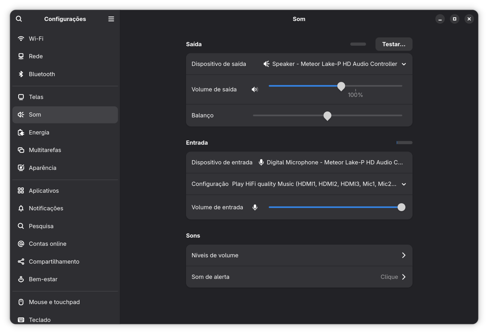
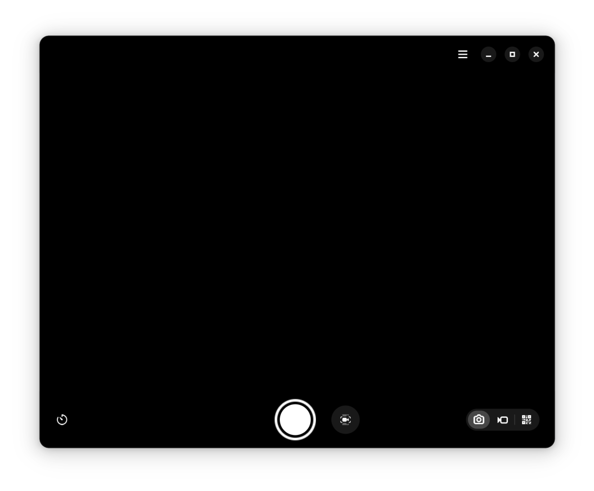
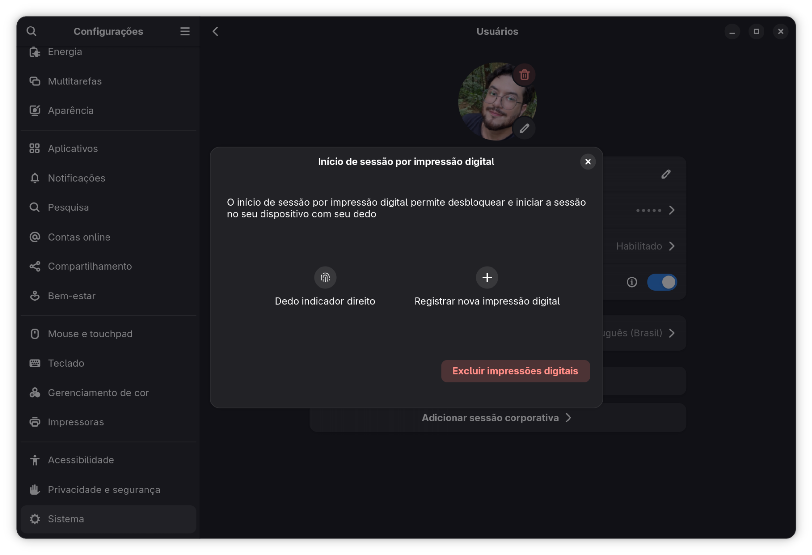
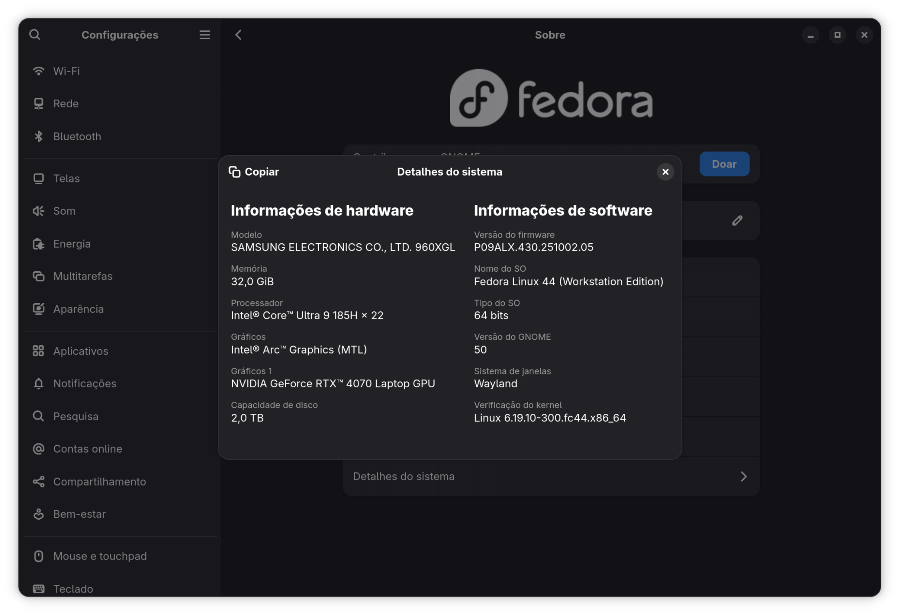

# Fedora no Samsung Galaxy Book4 Ultra

> [!IMPORTANT]
> **Atualizado em 5 de abril de 2026**
>
> Este guia reúne explicações técnicas, soluções práticas e informações úteis para usuários do Fedora no Samsung Galaxy Book4 Ultra, com foco em áudio, câmera, leitor de digital e drivers NVIDIA.
>
> O conteúdo histórico abaixo foi **revalidado em 5 de abril de 2026** em um **Samsung Galaxy Book4 Ultra NP960XGL-XG1BR**, rodando **Fedora 43** com kernel **6.18.8-200.fc43.x86_64**.


| Especificação       | Detalhes                                                                             |
| ----------------------- | :------------------------------------------------------------------------------------- |
| **Modelo**            | Samsung Galaxy Book4 Ultra (NP960XGL, NP960XGL-XG1BR, NP960XGLZ-EXP...)              |
| **Tela**              | 16" WQXGA+ (2880 x 1800) AMOLED Touchscreen                                          |
| **Processador**       | Intel Core Ultra 9 185H (Meteor Lake, 16C/22T, até 5.1 GHz, 24 MB cache)            |
| **GPU**               | NVIDIA GeForce RTX 4070 Laptop 8 GB GDDR6                                            |
| **Memória RAM**      | 32 GB LPDDR5X (soldada, não expansível)                                            |
| **Armazenamento**     | 1 TB SSD NVMe PCIe Gen4 (expansível via slot M.2 secundário, dependendo do modelo) |
| **Bateria**           | 76 Wh (integrada, íon-lítio)                                                       |
| **Carregador**        | 140 W USB-C (20V, 5A ou 28V, 5A)                                                     |
| **Portas**            | 2x Thunderbolt 4 (USB-C), 1x HDMI 2.1, 1x USB-A 3.2, 1x P2 (áudio), 1x MicroSD      |
| **Rede sem fio**      | Wi-Fi 6E (802.11ax), Bluetooth 5.3                                                   |
| **Webcam**            | 1080p FHD, sensor OmniVision OV02C10, IPU6 (MIPI)                                    |
| **Áudio**            | 2x Alto-falantes estéreo (AKG), microfone duplo, codec Realtek ALC298               |
| **Teclado**           | Teclado retroiluminado, layout ABNT2 (BR) ou US, sensor de digital integrado         |
| **Touchpad**          | Amplo, compatível com gestos Windows Precision                                      |
| **Leitor de Digital** | Integrado ao botão power, compatível com Windows Hello                             |
| **Dimensões**        | 355,4 x 250,4 x 16,5 mm                                                              |
| **Outros**            | Sensor de luz ambiente, suporte a Samsung Multi Control, Second Screen, Quick Share  |
| **Certificações**   | ENERGY STAR, RoHS, FCC, CE                                                           |

* [Manual do Usuário](https://downloadcenter.samsung.com/content/UM/202506/20250618100447559/94xXGK_96xXGK_96xXGL_Win11_UM_ENG_Rev.2.0_250602.pdf)
* [Especificações](https://www.samsung.com/br/support/model/NP960XGL-XG1BR/)

> [!TIP]
> **Kernel recomendado:** Utilize o kernel **6.15 ou superior** para garantir o reconhecimento adequado do hardware do Galaxy Book4 Ultra. Versões anteriores apresentam limitações significativas de compatibilidade.
>
> Ferramentas como o [samsung-galaxybook-extras](https://github.com/joshuagrisham/samsung-galaxybook-extras) podem facilitar a configuração inicial e aplicar ajustes específicos para este modelo.
>
> Caso você não seja um usuário avançado, recomendo que use o Windows 11, que já vem instalado de fábrica e funciona perfeitamente neste modelo.

---

## Índice

- [Fedora no Samsung Galaxy Book4 Ultra](#fedora-no-samsung-galaxy-book4-ultra)
  - [Índice](#índice)
  - [Incompatibilidades](#incompatibilidades)
  - [Alto-falantes Internos (Realtek ALC298)](#alto-falantes-internos-realtek-alc298)
  - [Câmera Interna (IPU6/OV02C10)](#câmera-interna-ipu6ov02c10)
  - [Leitor de Digital (Fingerprint)](#leitor-de-digital-fingerprint)
  - [Chip de Gráficos dedicados (NVIDIA RTX 4070)](#chip-de-gráficos-dedicados-nvidia-rtx-4070)
  - [Diagnósticos Rápidos](#diagnósticos-rápidos)
  - [Outros Relatos](#outros-relatos)

---

## Incompatibilidades


| Componente            | Status revalidado em abril de 2026 | Causa técnica resumida                                                                   |
| ----------------------- | :---------------------: | ------------------------------------------------------------------------------------------- |
| **Áudio interno**    | Parcial com workaround local | O bug upstream do ALSA continua relevante, mas o sistema atual já expõe `Speaker` e microfones via quirks locais do `snd-hda-intel` |
| **Câmera interna**   |     Não funciona     | Driver IPU6 OV02C10 não aceita clock de 26 MHz, necessário para o sensor Samsung        |
| **Leitor de digital** |   Parcial/instável   | O `fprintd` detecta o sensor Egis, mas cadastro e comportamento pós-suspensão ainda precisam de validação contínua |
| **NVIDIA RTX 4070**   | Funciona c/ ressalvas | Os módulos proprietários carregam, inclusive com Secure Boot ativo, mas updates e ferramentas de verificação ainda exigem atenção |
| **BIOS/Firmware**     |    Riscos recentes    | Updates recentes causam throttling, falhas em docks e Bluetooth                           |

---

## Alto-falantes Internos (Realtek ALC298)

O Galaxy Book4 Ultra usa o codec **Realtek ALC298**. No estado atual do meu notebook, o Linux já expõe `Speaker`, `Stereo Microphone` e `Digital Microphone`. O áudio interno deixou de ser um caso de “não funciona” e passou a ser um caso de **funciona com quirk local, mas ainda não está resolvido upstream**.

> [!IMPORTANT]
> Relatei no [bugzilla.kernel.org](https://bugzilla.kernel.org/show_bug.cgi?id=220363), que o kernel associa o hardware e, em logs avançados (anexo `alsa-info.log`), é possível ver o modelo do codec, mas a ausência de roteamento adequado (“speaker_outs=0”) no fixup do ALSA, impede o funcionamento do canal de alto-falantes internos. Nessa situação, apenas correções no driver/ALSA resolverá.
>
> No próprio bug, há também uma resposta de **Zhang Heng em 23 de dezembro de 2025** dizendo que o mapeamento do speaker em `0x17` parece normal e sugerindo testar três modelos no kernel:
>
> - `alc298-samsung-amp-v2-2-amps`
> - `alc298-samsung-amp-v2-4-amps`
> - `alc298-samsung-amp`
>
> Ele também sugere comparar o dump do codec com o Windows caso nenhum deles funcione.
>
> Em abril de 2026, esse contexto **continua útil como explicação upstream**, mas o estado prático do sistema já não é exatamente o mesmo descrito em 2025. Hoje, minha configuração funcional depende destes dois parâmetros no `snd-hda-intel`:
>
> - `model=alc298-samsung-amp-v2-2-amps`
> - `patch=alc298-internal-amp.fw`
>
> Isso é relevante porque, em **5 de abril de 2026**, eu já estava justamente usando `alc298-samsung-amp-v2-2-amps`, ou seja, uma das alternativas sugeridas no próprio bug.
>
> Em outras palavras: o problema **não está limpo/upstream**, mas também já não é mais correto resumir o estado atual apenas como “não funciona”.



### Configuração atual do áudio

Hoje, o que faz sentido manter é a configuração do próprio driver:

```bash
sudo tee /etc/modprobe.d/alc298.conf <<< 'options snd-hda-intel patch=alc298-internal-amp.fw'
sudo tee /etc/modprobe.d/audio-fix.conf <<< 'options snd-hda-intel model=alc298-samsung-amp-v2-2-amps'
sudo reboot
```

### Verificação

```bash
wpctl status
cat /sys/module/snd_hda_intel/parameters/model
cat /sys/module/snd_hda_intel/parameters/patch
speaker-test -c 2 -t wav
```

> [!CAUTION]
> Métodos que eu **não** considero mais parte da solução atual:
>
> - `speaker-init.service`
> - `samsung-audio-fix.service`
> - scripts de inicialização com `hda-verb`
>
> Esses caminhos ficaram legados no meu setup. Em abril de 2026, os services antigos de áudio estavam falhando no boot e já não definiam mais o comportamento real do sistema.
>
> Se esse quirk parar de funcionar, os próximos testes coerentes continuam sendo:
>
> - `alc298-samsung-amp-v2-4-amps`
> - `alc298-samsung-amp`
> - comparar o dump do codec com o Windows

---

## Câmera Interna (IPU6/OV02C10)

A câmera interna **continua sem funcionar** no Galaxy Book4 Ultra com Fedora. O sensor OmniVision OV02C10 é detectado, mas o probe falha porque o driver recebe um clock externo de `26 MHz`, enquanto esse caminho do driver continua esperando a configuração usada por outros modelos Samsung com `19.2 MHz`.

> [!IMPORTANT]
> Relatei o problema no [bugzilla.kernel.org](https://bugzilla.kernel.org/show_bug.cgi?id=220364), explicando a questão do clock e a incompatibilidade com o sensor OV02C10. Até **5 de abril de 2026**, o bug seguia **sem resposta upstream**. A solução definitiva depende de correções no driver IPU6.
>
> Em **5 de abril de 2026**, o erro continua reproduzível no boot:
>
> ```text
> external clock 26000000 is not supported
> probe with driver ov02c10 failed with error -22
> ```
>
> Também confirmei que o atributo `block_recording` do driver `samsung_galaxybook` estava em `0`, então a falha atual **não** parece estar relacionada ao atalho Fn+F10 ou a bloqueio lógico da webcam/microfone.
>
> Um ponto importante é que o userspace já tem perfis e tuning para `OV02C10` em `ipu6epmtl`, então o problema continua parecendo abaixo do userspace, no nível de ACPI/software node/clock ou da combinação de drivers carregados.



### Estado atual

Se eu preciso de webcam no Fedora hoje, a solução prática continua sendo usar uma webcam USB externa.

> [!NOTE]
> Métodos que eu **não** considero mais parte da solução atual:
>
> - `modprobe ov02c10 clock_frequency=19200000`
> - `ov02c10-clock-fix.service`
> - `v4l2-relayd` + `icamerasrc` como suposto workaround para a câmera interna
>
> O antigo experimento com `modprobe ov02c10 clock_frequency=19200000` ficou obsoleto. Hoje o módulo registra:
>
> ```text
> ov02c10: unknown parameter 'clock_frequency' ignored
> ```
>
> Portanto, esse workaround não corrige mais o problema real.

### Verificação

```bash
v4l2-ctl --list-devices
journalctl -b -k | grep -i ov02c10
cam -l
```

> [!CAUTION]
> **Erro comum**:
> ```external clock 26000000 is not supported ``` \
> ```probe with driver ov02c10 failed with error -22```
>
> O driver IPU6 não consegue inicializar o sensor OV02C10 devido à incompatibilidade de clock. Isso é esperado, pois o sensor da Samsung no Galaxy Book4 Ultra não é compatível com o clock de 19.2 MHz utilizado por outros modelos.
>
> Além disso, em abril de 2026:
>
> - `libcamera` ainda não enumera nenhuma câmera utilizável;
> - o `icamerasrc` não expõe `ov02c10-uf-*` como `device-name`;
> - o stack de userspace acabou selecionando `AR0234_TGL_10bits.aiqb`, apesar de haver perfis `OV02C10` instalados;
> - a webcam virtual `Intel MIPI Camera` criada por `v4l2loopback`/`v4l2-relayd` não deve ser tratada como prova de funcionamento da câmera interna;
> - o relay padrão usa `1280x720`, enquanto o `icamerasrc` anuncia caps NV12 com altura mínima `960`, adicionando erro de negociação no userspace.
>
> Isso indica que **não há, hoje, uma correção simples só em userspace**.

---

## Leitor de Digital (Fingerprint)

O sensor é detectado via `fprintd`, mas pode falhar após suspensão ou não aceitar cadastro.

Em abril de 2026, o dispositivo apareceu como **Egis Technology (LighTuning) Match-on-Chip** e o daemon `fprintd` subiu normalmente. O ponto que ainda falta validar é o uso diário, porque eu não tinha digitais cadastradas no momento dessa revisão.



### Solução parcial: reinstalar `fprintd` e `libfprint`, reconfigurar o sensor.

```bash
sudo dnf reinstall fprintd libfprint
sudo systemctl restart fprintd
fprintd-delete $USER
fprintd-enroll
sudo authselect enable-feature with-fingerprint
sudo authselect apply-changes
```

### Verificação

```bash
fprintd-verify
```

> [!CAUTION]
> **Erro comum**:
> ```Failed to enroll fingerprint: Device or resource busy```
>
> Por algum motivo, o sensor pode estar ocupado ou não configurado corretamente na inicialização. Como consequência, não consegue localizar a digital cadastrada anteriormente e utilizá-la para autenticação.

---

## Chip de Gráficos dedicados (NVIDIA RTX 4070)

Funciona bem com RPM Fusion, mas requer atenção com updates de kernel e Secure Boot com processo de MOK.

Em abril de 2026, os módulos `nvidia`, `nvidia_modeset`, `nvidia_drm` e `nvidia_uvm` estavam carregados com **Secure Boot habilitado**. Ou seja: o driver em si estava funcional.

Também vale separar duas coisas que costumam ser tratadas como se fossem a mesma:

- driver NVIDIA carregado;
- utilitário `nvidia-smi` instalado.

No meu caso, o driver estava funcionando mesmo sem o binário `nvidia-smi` no `PATH`. No Fedora/RPM Fusion, esse binário vem do pacote `xorg-x11-drv-nvidia-cuda`, então ele deve ser tratado como **ferramenta opcional de administração/diagnóstico**, não como pré-requisito para o driver existir.



### Solução: Instalação do driver NVIDIA

```bash
sudo dnf install https://mirrors.rpmfusion.org/free/fedora/rpmfusion-free-release-$(rpm -E %fedora).noarch.rpm
sudo dnf install https://mirrors.rpmfusion.org/nonfree/fedora/rpmfusion-nonfree-release-$(rpm -E %fedora).noarch.rpm
sudo dnf update
sudo dnf install akmod-nvidia xorg-x11-drv-nvidia-cuda
sudo reboot
```

Se a intenção for **só** ter o driver funcionando, o ponto principal é o `akmod-nvidia`.

Se a intenção for também ter o `nvidia-smi`, então faz sentido manter explicitamente o `xorg-x11-drv-nvidia-cuda` instalado.

Se falhar após update:

```bash
sudo akmods --force
sudo dracut --force
sudo reboot
```

Desative Secure Boot se for necessário.

### Verificação

Para verificar o **driver**:

```bash
lsmod | grep nvidia
mokutil --sb-state
```

Para verificar o **utilitário `nvidia-smi`**:

```bash
nvidia-smi
```

> [!CAUTION]
> `nvidia-smi` não deve ser o único critério para avaliar se o driver está funcionando.
>
> Se o comando nem existir, isso normalmente indica ausência do pacote `xorg-x11-drv-nvidia-cuda`, não ausência do driver.
>
> **Erro comum**:
> ```Unable to determine the device handle for GPU0: 0000:01:00.0: Unknown Error``` \
> ```No devices were found```
>
> O driver NVIDIA não está carregado corretamente ou o Secure Boot está bloqueando o módulo. Isso acontece a cada atualização de kernel, então pode ser necessário reinstalar o driver e configurar. Apesar de prático, ao optar por desativar o Secure Boot você perde a segurança adicional que ele oferece, então faça por sua conta e risco.

---

## Diagnósticos Rápidos

| Componente  | Comando de Diagnóstico                                                                                              |
| :---------- | :------------------------------------------------------------------------------------------------------------------ |
| **Kernel**  | `uname -r`                                                                                                          |
| **Áudio**   | `aplay -l && wpctl status && cat /sys/module/snd_hda_intel/parameters/model && cat /sys/module/snd_hda_intel/parameters/patch` |
| **Câmera**  | `v4l2-ctl --list-devices && journalctl -b -k \| grep -i ov02c10 && cam -l && systemctl status v4l2-relayd.service --no-pager` |
| **Digital** | `fprintd-list $USER && systemctl status fprintd.service --no-pager && journalctl -b \| grep -i fprint` |
| **NVIDIA**  | `lsmod \| grep nvidia && mokutil --sb-state && rpm -qa \| grep -i nvidia` |

## Outros Relatos

> [!NOTE]
> Estes links contêm relatos e experiências de outros usuários com o Galaxy Book4 Ultra no linux, abordando desde problemas de hardware até tentativas de soluções criativas.

- [Relato de tentativa de engenharia reversa para alto-falantes internos no EndeavourOS](https://github.com/dgunay/galaxy-book4-pro-reverse-engineering)
- [Relato com uso do Fedora 42 (KDE) com medições de desempenho da Intel Xe Iris](https://github.com/jusqua/galaxy-book4-linux)
