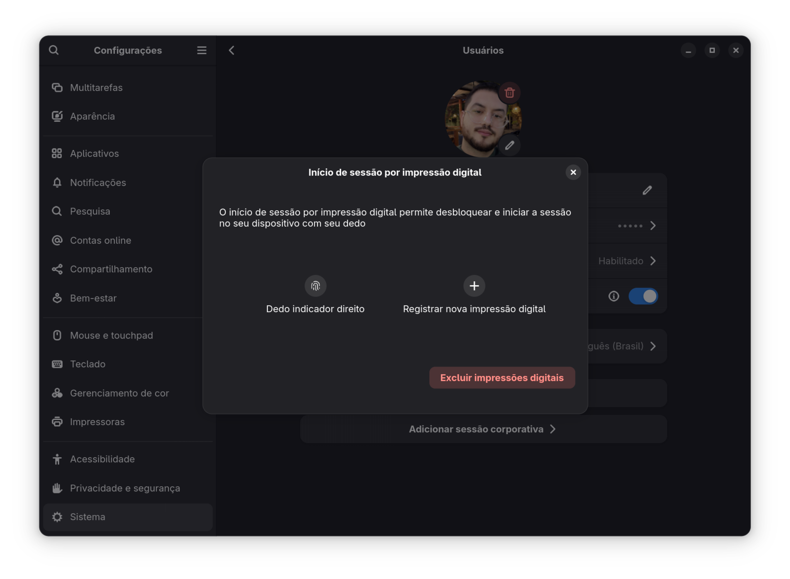

# Fedora 42 Workstation no Samsung Galaxy Book4 Ultra

> [!IMPORTANT]
> **Atualizado em julho de 2025**
>
> Este guia reúne explicações técnicas, soluções práticas e informações úteis para usuários do Fedora 42 no Samsung Galaxy Book4 Ultra, com foco em áudio, câmera, leitor de digital e drivers NVIDIA.


| Especificação       | Detalhes                                                                             |
| ----------------------- | :------------------------------------------------------------------------------------- |
| **Modelo**            | Samsung Galaxy Book4 Ultra (NP960XGL, NP960XGL-XG1BR, NP960XGLZ-EXP...)              |
| **Tela**              | 16" WQXGA+ (2880 x 1800) AMOLED Touchscreen                                          |
| **Processador**       | Intel Core Ultra 9 185H (Meteor Lake, 16C/22T, até 5.1 GHz, 24 MB cache)            |
| **GPU**               | NVIDIA GeForce RTX 4070 Laptop 8 GB GDDR6                                            |
| **Memória RAM**      | 32 GB LPDDR5X (soldada, não expansível)                                            |
| **Armazenamento**     | 1 TB SSD NVMe PCIe Gen4 (expansível via slot M.2 secundário, dependendo do modelo) |
| **Bateria**           | 76 Wh (integrada, íon-lítio)                                                       |
| **Carregador**        | 140 W USB-C (20V, 5A ou 28V, 5A)                                                     |
| **Portas**            | 2x Thunderbolt 4 (USB-C), 1x HDMI 2.1, 1x USB-A 3.2, 1x P2 (áudio), 1x MicroSD      |
| **Rede sem fio**      | Wi-Fi 6E (802.11ax), Bluetooth 5.3                                                   |
| **Webcam**            | 1080p FHD, sensor OmniVision OV02C10, IPU6 (MIPI)                                    |
| **Áudio**            | 2x Alto-falantes estéreo (AKG), microfone duplo, codec Realtek ALC298               |
| **Teclado**           | Teclado retroiluminado, layout ABNT2 (BR) ou US, sensor de digital integrado         |
| **Touchpad**          | Amplo, compatível com gestos Windows Precision                                      |
| **Leitor de Digital** | Integrado ao botão power, compatível com Windows Hello                             |
| **Dimensões**        | 355,4 x 250,4 x 16,5 mm                                                              |
| **Outros**            | Sensor de luz ambiente, suporte a Samsung Multi Control, Second Screen, Quick Share  |
| **Certificações**   | ENERGY STAR, RoHS, FCC, CE                                                           |

* [Manual do Usuário](https://downloadcenter.samsung.com/content/UM/202506/20250618100447559/94xXGK_96xXGK_96xXGL_Win11_UM_ENG_Rev.2.0_250602.pdf)
* [Especificações](https://www.samsung.com/br/support/model/NP960XGL-XG1BR/)

> [!TIP]
> **Kernel recomendado:** Utilize o kernel **6.15 ou superior** para garantir o reconhecimento adequado do hardware do Galaxy Book4 Ultra. Versões anteriores apresentam limitações significativas de compatibilidade.
>
> Ferramentas como o [samsung-galaxybook-extras](https://github.com/joshuagrisham/samsung-galaxybook-extras) podem facilitar a configuração inicial e aplicar ajustes específicos para este modelo.
>
> Caso você não seja um usuário avançado, recomendo que use o Windows 11, que já vem instalado de fábrica e funciona perfeitamente neste modelo.

---

## Índice

- [Fedora 42 Workstation no Samsung Galaxy Book4 Ultra](#fedora-42-workstation-no-samsung-galaxy-book4-ultra)
  - [Índice](#índice)
  - [Incompatibilidades](#incompatibilidades)
  - [Alto-falantes Internos (Realtek ALC298)](#alto-falantes-internos-realtek-alc298)
    - [Solução parcial: Script de Inicialização (HDA Verb)](#solução-parcial-script-de-inicialização-hda-verb)
    - [Verificação](#verificação)
  - [Câmera Interna (IPU6/OV02C10)](#câmera-interna-ipu6ov02c10)
    - [Solução parcial: usar webcam USB](#solução-parcial-usar-webcam-usb)
    - [Verificação](#verificação-1)
  - [Leitor de Digital (Fingerprint)](#leitor-de-digital-fingerprint)
    - [Solução parcial: reinstalar `fprintd` e `libfprint`, reconfigurar o sensor.](#solução-parcial-reinstalar-fprintd-e-libfprint-reconfigurar-o-sensor)
    - [Verificação](#verificação-2)
  - [Chip de Gráficos dedicados (NVIDIA RTX 4070)](#chip-de-gráficos-dedicados-nvidia-rtx-4070)
    - [Solução: Instalação do driver NVIDIA](#solução-instalação-do-driver-nvidia)
    - [Verificação](#verificação-3)
  - [Diagnósticos Rápidos](#diagnósticos-rápidos)
  - [Outros Relatos](#outros-relatos)

---

## Incompatibilidades


| Componente            |   Status Fedora 42   | Causa técnica resumida                                                                   |
| ----------------------- | :---------------------: | ------------------------------------------------------------------------------------------- |
| **Áudio interno**    |     Não funciona     | Driver ALSA não ativa alto-falantes internos (bug), apenas HDMI/Bluetooth/Fone de ouvido |
| **Câmera interna**   |     Não funciona     | Driver IPU6 OV02C10 não aceita clock de 26 MHz, necessário para o sensor Samsung        |
| **Leitor de digital** |   Parcial/instável   | libfprint não suporta todos os sensores, problemas pós-suspensão                       |
| **NVIDIA RTX 4070**   | Funciona c/ ressalvas | Driver proprietário pode falhar após update de kernel, Secure Boot pode bloquear        |
| **BIOS/Firmware**     |    Riscos recentes    | Updates recentes causam throttling, falhas em docks e Bluetooth                           |

---

## Alto-falantes Internos (Realtek ALC298)

O Galaxy Book4 Ultra usa o codec **Realtek ALC298**. Embora o Linux reconheça corretamente o hardware, existe atualmente uma limitação no driver ALSA que faz com que **o amplificador dos alto-falantes internos não seja ativado automaticamente** pelo sistema operacional. Como consequência, o som só funciona via HDMI, Bluetooth ou fones de ouvido, porém, os alto-falantes internos permanecem desligados, mesmo com o dispositivo detectado no sistema.

> [!IMPORTANT]
> Relatei no [bugzilla.kernel.org](https://bugzilla.kernel.org/show_bug.cgi?id=220363), que o kernel associa o hardware e, em logs avançados (anexo `alsa-info.log`), é possível ver o modelo do codec, mas a ausência de roteamento adequado (“speaker_outs=0”) no fixup do ALSA, impede o funcionamento do canal de alto-falantes internos. Nessa situação, apenas correções no driver/ALSA resolverá.


### Solução parcial: Script de Inicialização (HDA Verb)

Apesar das limitações do kernel/driver, pode ser útil automatizar a tentativa de ativação do amplificador via script, tanto para facilitar novos testes quanto para documentar para futuras correções upstream.

1. Instale ferramentas:

```bash
sudo dnf install alsa-tools alsa-sof-firmware
```

2. Crie o script de inicialização com comandos HDA adequados:

```bash
sudo tee /usr/local/bin/galaxy-book4-audio-fix.sh << EOF
#!/bin/bash
HDA_DEV="/dev/snd/hwC0D0"
hda-verb \$HDA_DEV 0x20 0x500 0x45
hda-verb \$HDA_DEV 0x20 0x501 0x3000
hda-verb \$HDA_DEV 0x1a 0x707 0xc5
hda-verb \$HDA_DEV 0x1a 0x3 0x00
EOF
```

3. Dê permissão e crie o service:

```bash
sudo chmod +x /usr/local/bin/galaxy-book4-audio-fix.sh
```

Crie o arquivo `/etc/systemd/system/speaker-init.service` com:

```bash
sudo tee /etc/systemd/system/speaker-init.service << EOF
[Unit]
Description=Galaxy Book Speaker Fix
After=sound.target

[Service]
Type=oneshot
ExecStart=/usr/local/bin/galaxy-book4-audio-fix.sh

[Install]
WantedBy=multi-user.target
EOF
```

4. Ative o serviço systemd:

```bash
sudo systemctl enable --now speaker-init.service
```

### Verificação

Para testar se houve efeito, utilize:

```bash
speaker-test -c 2 -t wav
```

> [!CAUTION]
> **Erro comum**:
> O comando executa, mas não há som e não retorna erro – indicando exatamente o bug do roteamento/fixup.
>
> Durante os testes, utilizei também o [script `necessary-verbs.sh`](https://github.com/joshuagrisham/galaxy-book2-pro-linux/blob/main/sound/necessary-verbs.sh), mas **não recomendo seu uso integral no Book4 Ultra** pois:
>
> - Executa sequências para múltiplos modelos Samsung que podem não existir no Book4 Ultra;
> - Pode deixar o subsistema de áudio em estado inconsistente;
> - O bug central está no fixup do driver ALSA, não superado por scripts de configuração;

---

## Câmera Interna (IPU6/OV02C10)

O driver incluso no kernel 6.15 ou superior, reconhece o sensor OmniVision OV02C10, porém **não suporta o clock de 26 MHz** utilizado pela Samsung neste modelo, aceitando apenas sensores configurados para 19.2 MHz. Embora alguns usuários do **Galaxy Book3 Ultra** (NP960XFHZ-EXP) tenham conseguido utilizar a câmera interna, isso ocorreu porque o sensor deles, apesar de ser o mesmo modelo, opera em 19.2 MHz — diferente do **Galaxy Book4 Ultra** (NP960XGLZ-EXP), que permanece incompatível devido à diferença de clock.

> [!IMPORTANT]
> Relatei o problema no [bugzilla.kernel.org](https://bugzilla.kernel.org/show_bug.cgi?id=220364), explicando a questão do clock e a incompatibilidade com o sensor OV02C10. A solução definitiva depende de correções no driver IPU6.


### Solução parcial: usar webcam USB

Ainda não há solução parcial ou definitiva para a câmera interna. A melhor alternativa é usar uma webcam USB externa.

### Verificação

```bash
v4l2-ctl --list-devices
```

> [!CAUTION]
> **Erro comum**:
> ```external clock 26000000 is not supported ``` \
> ```probe with driver ov02c10 failed with error -22```
>
> O driver IPU6 não consegue inicializar o sensor OV02C10 devido à incompatibilidade de clock. Isso é esperado, pois o sensor da Samsung no Galaxy Book4 Ultra não é compatível com o clock de 19.2 MHz utilizado por outros modelos. Cogitei de tentar **engenharia reversa** para ajustar o clock, mas isso é **complexo** e **arriscado**, podendo **danificar o hardware.**

---

## Leitor de Digital (Fingerprint)

O sensor é detectado via `fprintd`, mas pode falhar após suspensão ou não aceitar cadastro.



### Solução parcial: reinstalar `fprintd` e `libfprint`, reconfigurar o sensor.

```bash
sudo dnf reinstall fprintd libfprint
sudo systemctl restart fprintd
fprintd-delete $USER
fprintd-enroll
sudo authselect enable-feature with-fingerprint
sudo authselect apply-changes
```

### Verificação

```bash
fprintd-verify
```

> [!CAUTION]
> **Erro comum**:
> ```Failed to enroll fingerprint: Device or resource busy```
>
> Por algum motivo, o sensor pode estar ocupado ou não configurado corretamente na inicialização. Como consequência, não consegue localizar a digital cadastrada anteriormente e utilizá-la para autenticação.

---

## Chip de Gráficos dedicados (NVIDIA RTX 4070)

Funciona bem com RPM Fusion, mas requer atenção com updates de kernel e Secure Boot com processo de MOK.


### Solução: Instalação do driver NVIDIA

```bash
sudo dnf install https://mirrors.rpmfusion.org/free/fedora/rpmfusion-free-release-$(rpm -E %fedora).noarch.rpm
sudo dnf install https://mirrors.rpmfusion.org/nonfree/fedora/rpmfusion-nonfree-release-$(rpm -E %fedora).noarch.rpm
sudo dnf update
sudo dnf install akmod-nvidia xorg-x11-drv-nvidia-cuda
sudo reboot
```

Se falhar após update:

```bash
sudo akmods --force
sudo dracut --force
sudo reboot
```

Desative Secure Boot se for necessário.

### Verificação

```bash
nvidia-smi
```

> [!CAUTION]
> **Erro comum**:
> ```Unable to determine the device handle for GPU0: 0000:01:00.0: Unknown Error``` \
> ```No devices were found```
>
> O driver NVIDIA não está carregado corretamente ou o Secure Boot está bloqueando o módulo. Isso acontece a cada atualização de kernel, então pode ser necessário reinstalar o driver e configurar. Apesar de prático, ao optar por desativar o Secure Boot você perde a segurança adicional que ele oferece, então faça por sua conta e risco.

---

## Diagnósticos Rápidos

| Componente  | Comando de Diagnóstico                                                                                              |
| :---------- | :------------------------------------------------------------------------------------------------------------------ |
| **Kernel**  | `uname -r`                                                                                                          |
| **Áudio**   | `aplay -l && speaker-test -c 2 -t wav`                                                                            |
| **Câmera**  | `v4l2-ctl --list-devices && sudo dmesg \| grep -i ov02c10 && dmesg \| grep -i cam && lsmod \| grep ov02c10` |
| **Digital** | `fprintd-verify && journalctl -b \| grep -i fprint`                                                                 |
| **NVIDIA**  | `nvidia-smi && lsmod \| grep nvidia && sudo dmesg \| grep nvidia`                                                   |

## Outros Relatos

> [!NOTE]
> Estes links contêm relatos e experiências de outros usuários com o Galaxy Book4 Ultra no linux, abordando desde problemas de hardware até tentativas de soluções criativas.

- [Relato de tentativa de engenharia reversa para alto-falantes internos no EndeavourOS](https://github.com/dgunay/galaxy-book4-pro-reverse-engineering)
- [Relato com uso do Fedora 42 (KDE) com medições de desempenho da Intel Xe Iris](https://github.com/jusqua/galaxy-book4-linux)